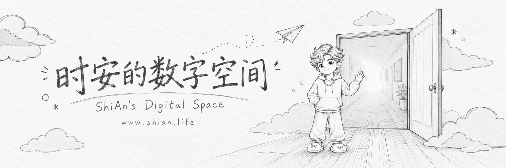
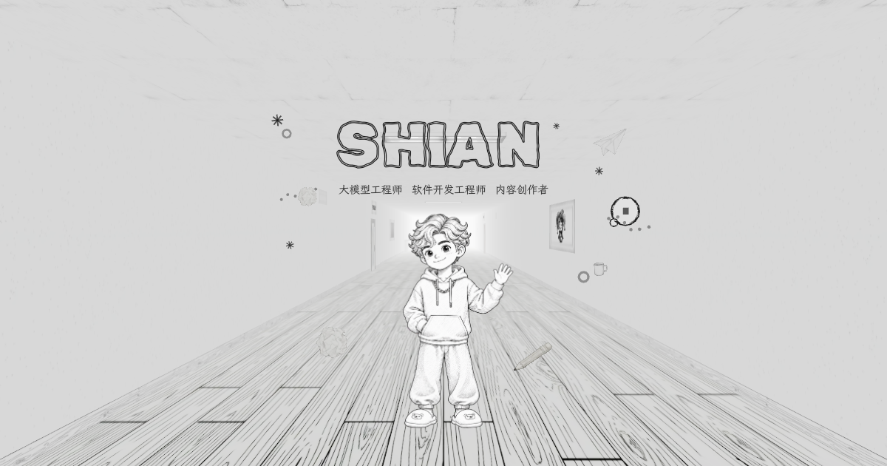
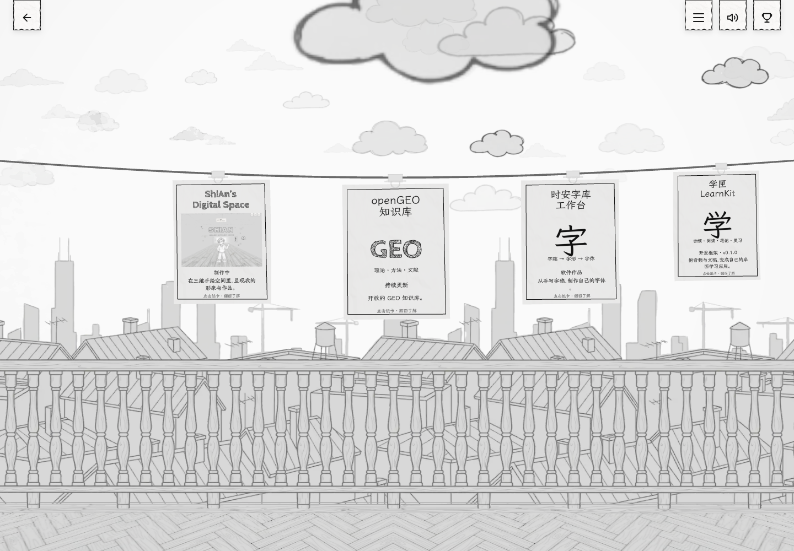
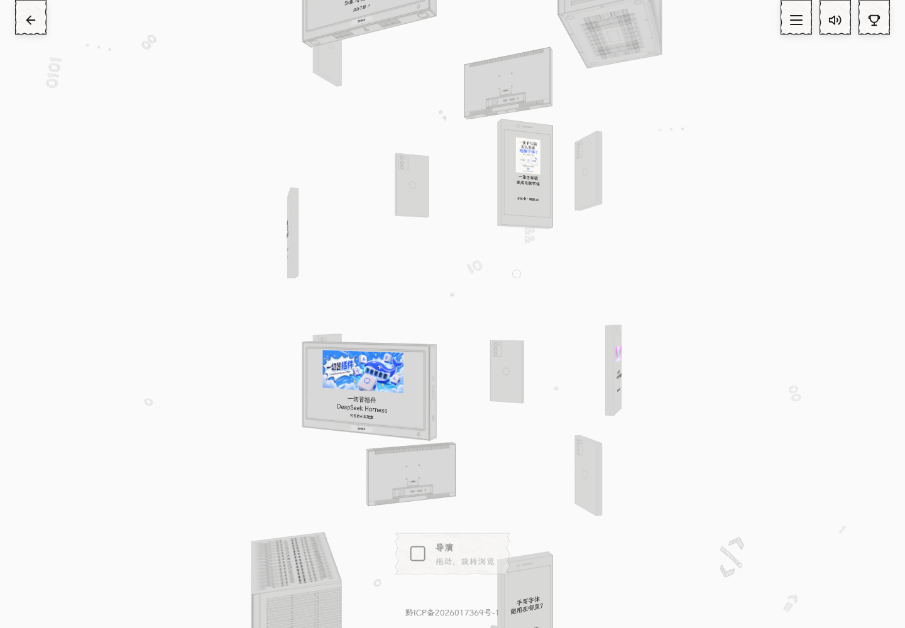
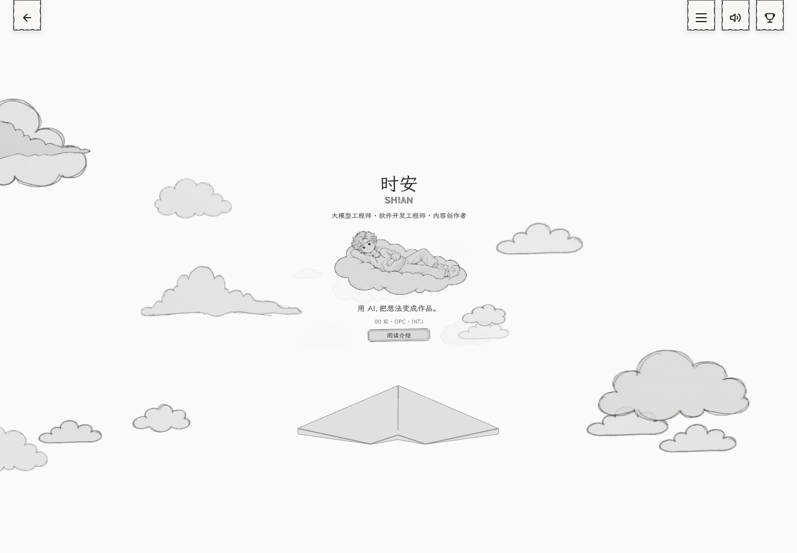
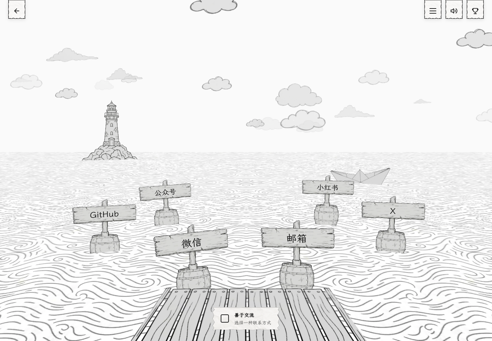
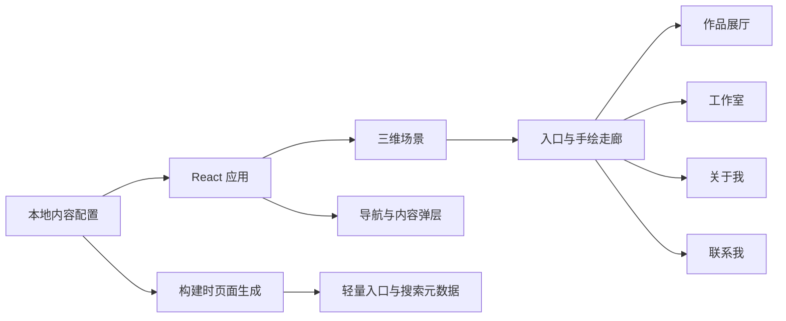

<div align="center">

[](https://www.shian.life/)

# ShiAn’s Digital Space

### 时安的数字空间

**A hand-drawn world for ideas, projects, and the person behind them.**

用一座可以探索的手绘三维空间，连接作品、知识与人。

[](https://www.shian.life/)
[](https://github.com/shianlab/shian-digital-space/actions/workflows/ci.yml)
[](LICENSE)
[](package.json)
[](package.json)

**[进入数字空间 ↗](https://www.shian.life/)** · **[轻量入口](https://www.shian.life/start/)** · **[快速开始](#快速开始)** · **[定制指南](docs/CUSTOMIZATION.md)**

</div>

## 项目简介

**ShiAn’s Digital Space** 是时安的个人网站，也是一份开放的三维网站实现。它将个人介绍、软件作品、AI 实践和知识资源组织成一座可探索的空间：推开门，走进手绘走廊，再进入不同主题的房间。

项目基于 [Tomasz Szmajda / ITom 的三维作品集](https://github.com/ITomPoland/portfolio-itom) 进行中文化与个人内容适配，加入了中文排版、本地内容配置、个人形象、移动端导航和轻量入口。你可以阅读代码、研究场景交互，也可以在遵守[代码与素材许可](#许可与致谢)的前提下定制自己的数字空间。

**网站默认通过本地内容运行，无需 CMS、数据库、账号登录或服务端 API。** 可选的访问统计默认关闭。

## 在线体验

[](https://www.shian.life/)

*网站实际入口画面。顶部横幅为 AI 辅助生成的手绘概念视觉。*

| 空间 | 你可以在这里做什么 | 入口 |
| :--- | :--- | :--- |
| 手绘走廊 | 从入口进入，探索房门与地图导航 | [www.shian.life](https://www.shian.life/) |
| 作品展厅 | 查看数字空间、openGEO、字库工作台与学匣等作品 | [/gallery](https://www.shian.life/gallery) |
| 工作室 | 浏览 AI 文章、创作内容和知识资源 | [/studio](https://www.shian.life/studio) |
| 关于我 | 了解个人介绍、专业资质与社区经历 | [/about](https://www.shian.life/about) |
| 联系我 | 选择微信、邮箱与社交主页 | [/contact](https://www.shian.life/contact) |
| 轻量入口 | 从静态页面直接访问内容与联系入口 | [/start/](https://www.shian.life/start/) |

<table>
  <tr>
    <td width="50%"><a href="https://www.shian.life/gallery"></a><p align="center"><b>作品展厅</b> · 把作品挂进空间</p></td>
    <td width="50%"><a href="https://www.shian.life/studio"></a><p align="center"><b>工作室</b> · 连接文章与创作</p></td>
  </tr>
  <tr>
    <td width="50%"><a href="https://www.shian.life/about"></a><p align="center"><b>关于我</b> · 在云端认识时安</p></td>
    <td width="50%"><a href="https://www.shian.life/contact"></a><p align="center"><b>联系我</b> · 在海边开始交流</p></td>
  </tr>
</table>

*以上为网站实际画面。三维体验需要浏览器支持 WebGL；设备图形能力不足时，可使用轻量入口。*

## 功能特性

- **空间式导航**：入口动画、循环走廊、四个主题房间、地图跳转和浏览器历史导航。
- **手绘视觉与动态呈现**：纸张纹理、线稿形象、手写标签、GSAP 镜头过渡和场景着色效果。
- **中文内容配置**：个人信息、作品、工作室内容与联系渠道集中维护，内容与场景组件分离。
- **按需加载与性能适配**：房间模块延迟加载，按设备条件选择渲染档位，并在帧率下降时降档。
- **多种访问方式**：桌面与触控导航、键盘入口、语义化内容、减少动态效果偏好和场景异常恢复。
- **静态部署与搜索元数据**：构建时生成页面标题、canonical、结构化数据、sitemap 与 robots.txt。

## 技术栈

| 层级 | 技术 | 作用 |
| :--- | :--- | :--- |
| 应用 | React 19 | 界面、状态与内容展示 |
| 三维渲染 | Three.js、React Three Fiber、Drei | 场景、相机、材质与交互 |
| 动画 | GSAP | 镜头运动与空间过渡 |
| 样式 | Sass / SCSS | 导航、弹层与中文排版 |
| 构建 | Vite 7 | 本地开发、资源打包与静态输出 |
| 验证 | Node.js Test Runner、ESLint、GitHub Actions | 内容、资源与生产代码检查 |

## 快速开始

需要 **Node.js 22.12 或更新版本**，以及 npm、Git。

```bash
git clone https://github.com/shianlab/shian-digital-space.git
cd shian-digital-space
npm ci
npm run dev
```

打开终端显示的本地地址，通常为 `http://localhost:5173`。第一次加载会请求场景素材；检查实际发布体验时，使用生产构建预览。

```bash
npm run lint:app
npm test
npm run build
npm run preview
```

生产文件输出到 `dist/`，预览地址通常为 `http://localhost:4173`。`predev` 和 `prebuild` 会自动同步入口 HTML、轻量页面与搜索元数据。

<details>
<summary><b>可用命令与可选配置</b></summary>

| 命令 | 说明 |
| :--- | :--- |
| `npm run dev` | 启动本地开发服务器 |
| `npm run build` | 同步内容并生成生产构建 |
| `npm run preview` | 预览 `dist/` |
| `npm test` | 运行路由、中文处理、内容与音效测试 |
| `npm run lint:app` | 检查生产入口及其静态、动态导入的应用模块 |
| `npm run lint` | 全量诊断；保留的历史场景示例仍有待整理的问题 |
| `node scripts/check-release-assets.mjs` | 构建后检查静态资源、入口和许可证完整性 |

访问统计为可选项。如果需要，将 `.env.example` 复制为 `.env.local`，填入自己的 `VITE_POSTHOG_KEY` 和 `VITE_POSTHOG_HOST`；两个值同时存在时才启用。所有 `VITE_` 变量会进入浏览器代码，不要用于存放服务端密钥。

</details>

## 定制你的空间

主要内容位于 [`src/config/`](src/config)。修改配置后，重新运行开发服务器或构建即可。

| 想修改的内容 | 文件 |
| :--- | :--- |
| 网站名称、身份、域名与页面元数据 | [`site-profile.js`](src/config/site-profile.js) |
| 个人介绍、资质、荣誉与社区经历 | [`about-profile.js`](src/config/about-profile.js) |
| 作品列表、介绍、预览图与外链 | [`gallery-projects.js`](src/config/gallery-projects.js) |
| 工作室文章、视频与知识资源 | [`studio-content.js`](src/config/studio-content.js) |
| 微信、邮箱与社交主页 | [`contact-channels.js`](src/config/contact-channels.js) |
| 房间名称、路由与地图信息 | [`rooms.js`](src/config/rooms.js) |
| 页脚备案信息 | [`site-filing.js`](src/config/site-filing.js) |
| 渲染档位与性能参数 | [`performance.js`](src/config/performance.js) |

部署你自己的版本前，请替换个人信息、联系方式、域名、备案信息和品牌素材。新增中文文本时，也要检查现有字体子集是否包含所需字形。具体步骤见[定制指南](docs/CUSTOMIZATION.md)。

## 项目结构

```text
src/
├── components/
│   ├── canvas/           # 入口、走廊与四个三维房间
│   ├── dom/              # 加载、过渡与错误恢复
│   └── ui/               # 导航、弹层、联系与音量界面
├── config/               # 个人内容、路由、字体与渲染参数
├── context/              # 场景、性能、音频与成就状态
├── hooks/                # 相机、元数据与本地内容
├── styles/               # SCSS 样式
└── utils/                # 音频、输入、WebGL 与可选统计
public/                   # 纹理、字体、图片、音效与轻量入口
scripts/                  # 页面同步、素材处理与检查工具
tests/                   # Node.js 测试
docs/                    # 定制、部署、许可与实景预览
```



## 部署

```bash
npm ci
npm run build
```

将 **`dist/` 的内容**发布到静态托管服务的站点根目录，并配置房间路径与轻量入口的路由。当前线上网站使用 CloudBase 静态托管；源码与特定云账号解耦，可部署到其他静态托管服务。

路由、缓存与自有域名设置见[部署指南](docs/DEPLOYMENT.md)。

## 参与贡献

欢迎提交清晰的 Bug 报告、文档改进、中文与无障碍优化、性能改进，以及可复用的场景交互。

1. Fork 仓库并创建分支。
2. 完成修改，说明问题、预期行为和验证结果。
3. 运行 `npm run lint:app`、`npm test` 和 `npm run build`。
4. 提交 Pull Request；涉及视觉变化时，附桌面与手机截图。

详细约定见 [CONTRIBUTING.md](CONTRIBUTING.md)。问题反馈使用 [Issues](https://github.com/shianlab/shian-digital-space/issues)，也可以通过[网站联系入口](https://www.shian.life/contact)找到时安。

## 许可与致谢

**代码采用 [MIT License](LICENSE)。图片、场景纹理、人物形象、文章与字体分别遵循各自的许可，不因代码开源而自动转为 MIT。** 使用或再次分发素材前，请阅读[素材与第三方许可说明](docs/ASSETS.md)。

- 感谢 **[Tomasz Szmajda / ITom](https://github.com/ITomPoland/portfolio-itom)** 提供原始三维作品集代码与手绘场景设计。保留原作者版权声明，并归档[原模板说明](docs/UPSTREAM.md)。
- 感谢 React、Three.js、React Three Fiber、Drei、GSAP、Vite 等项目，以及 LXGW WenKai 和其他字体的贡献者。
- 中文适配、个人内容整合与项目维护：**[时安 · shianlab](https://github.com/shianlab)**。

<div align="center">

**[走进时安的数字空间 ↗](https://www.shian.life/)**

</div>
